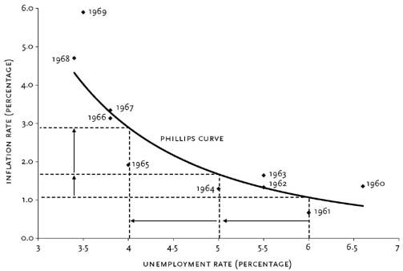

```python
#import libraries
import pandas as pd
import numpy as np
import matplotlib.pyplot as plt
import seaborn as sns
import plotly
%matplotlib inline
import warnings
warnings.filterwarnings('ignore')
import datetime
```


```python
#import data and examine columns
data = pd.read_csv('FI Case Data.csv')
data.columns.tolist()
```


    ['Data', 'Year', 'Month ', 'Value']


```python
#examine unique metrics
data.Data.unique()
```


    array(['Consumer Price Index', 'Unemployment Level',
           'Civilian Labor Force', 'CPI'], dtype=object)


```python
#reformat 
data = data.replace('Consumer Price Index', 'CPI')
data.Data.unique()
```


    array(['CPI', 'Unemployment Level', 'Civilian Labor Force'], dtype=object)


```python
#examine datatypes
data.info()
```

    <class 'pandas.core.frame.DataFrame'>
    RangeIndex: 1948 entries, 0 to 1947
    Data columns (total 4 columns):
    Data      1948 non-null object
    Year      1948 non-null int64
    Month     1948 non-null int64
    Value     1948 non-null float64
    dtypes: float64(1), int64(2), object(1)
    memory usage: 61.0+ KB
    


```python
#examine statistical qualities of dataset
data.describe()
```


<div>
<style scoped>
    .dataframe tbody tr th:only-of-type {
        vertical-align: middle;
    }

    .dataframe tbody tr th {
        vertical-align: top;
    }

    .dataframe thead th {
        text-align: right;
    }
</style>
<table border="1" class="dataframe">
  <thead>
    <tr style="text-align: right;">
      <th></th>
      <th>Year</th>
      <th>Month</th>
      <th>Value</th>
    </tr>
  </thead>
  <tbody>
    <tr>
      <th>count</th>
      <td>1948.000000</td>
      <td>1948.000000</td>
      <td>1948.000000</td>
    </tr>
    <tr>
      <th>mean</th>
      <td>1981.856263</td>
      <td>6.348049</td>
      <td>18196.392837</td>
    </tr>
    <tr>
      <th>std</th>
      <td>20.091212</td>
      <td>3.460395</td>
      <td>38979.755563</td>
    </tr>
    <tr>
      <th>min</th>
      <td>1947.000000</td>
      <td>1.000000</td>
      <td>21.480000</td>
    </tr>
    <tr>
      <th>25%</th>
      <td>1964.000000</td>
      <td>3.000000</td>
      <td>114.175000</td>
    </tr>
    <tr>
      <th>50%</th>
      <td>1982.000000</td>
      <td>6.000000</td>
      <td>3030.500000</td>
    </tr>
    <tr>
      <th>75%</th>
      <td>1999.000000</td>
      <td>9.000000</td>
      <td>8221.500000</td>
    </tr>
    <tr>
      <th>max</th>
      <td>2017.000000</td>
      <td>12.000000</td>
      <td>159580.000000</td>
    </tr>
  </tbody>
</table>
</div>


```python
#create function to create dataframe of metric data by annual means
def dfcreator(df, my_list=[]):
    new_df = pd.DataFrame()
    new_df['Year'] =(df['Year'].unique)
    new_df = new_df.set_index('Year')
    for i in my_list:
        temp_df = df.loc[(df['Data']) == i]
        temp_df = temp_df.groupby('Year').mean()
        temp_df = temp_df.drop('Month ',axis=1)
        temp_df[str(i)+'_Value'] = temp_df
        new_df = pd.concat([new_df, temp_df])
        temp_df = pd.DataFrame()
    new_df = new_df.groupby('Year').mean()
    new_df = new_df.drop('Value', axis=1)
    return new_df
```


```python
#create and examine new dataframe
metric_list =['CPI','Unemployment Level', 'Civilian Labor Force']
metric_data = dfcreator(data,my_list=metric_list)
metric_data.tail()
```


<div>
<style scoped>
    .dataframe tbody tr th:only-of-type {
        vertical-align: middle;
    }

    .dataframe tbody tr th {
        vertical-align: top;
    }

    .dataframe thead th {
        text-align: right;
    }
</style>
<table border="1" class="dataframe">
  <thead>
    <tr style="text-align: right;">
      <th></th>
      <th>CPI_Value</th>
      <th>Civilian Labor Force_Value</th>
      <th>Unemployment Level_Value</th>
    </tr>
    <tr>
      <th>Year</th>
      <th></th>
      <th></th>
      <th></th>
    </tr>
  </thead>
  <tbody>
    <tr>
      <th>2013</th>
      <td>232.948917</td>
      <td>155395.5</td>
      <td>11456.583333</td>
    </tr>
    <tr>
      <th>2014</th>
      <td>236.703917</td>
      <td>155906.5</td>
      <td>9598.166667</td>
    </tr>
    <tr>
      <th>2015</th>
      <td>236.987250</td>
      <td>157128.0</td>
      <td>8287.833333</td>
    </tr>
    <tr>
      <th>2016</th>
      <td>240.009250</td>
      <td>159186.5</td>
      <td>7749.583333</td>
    </tr>
    <tr>
      <th>2017</th>
      <td>244.307000</td>
      <td>NaN</td>
      <td>7581.500000</td>
    </tr>
  </tbody>
</table>
</div>


```python
#define and create inflation and unemployment rate functions
def inflation(cpi_initial, cpi_end):
    return ((cpi_end - cpi_initial)/ cpi_initial) * 100

def unemployment_rate(unemployment_level, labor_force):
    return (unemployment_level / labor_force) * 100

```


```python
#pass inflation and unemployment rate functions over dataframe
metric_data['Inflation'] = inflation(metric_data.CPI_Value.shift(), metric_data.CPI_Value)
metric_data['Unemployment_Rate'] = unemployment_rate(metric_data['Unemployment Level_Value'], metric_data['Civilian Labor Force_Value'])
metric_data.tail()
```


<div>
<style scoped>
    .dataframe tbody tr th:only-of-type {
        vertical-align: middle;
    }

    .dataframe tbody tr th {
        vertical-align: top;
    }

    .dataframe thead th {
        text-align: right;
    }
</style>
<table border="1" class="dataframe">
  <thead>
    <tr style="text-align: right;">
      <th></th>
      <th>CPI_Value</th>
      <th>Civilian Labor Force_Value</th>
      <th>Unemployment Level_Value</th>
      <th>Inflation</th>
      <th>Unemployment_Rate</th>
    </tr>
    <tr>
      <th>Year</th>
      <th></th>
      <th></th>
      <th></th>
      <th></th>
      <th></th>
    </tr>
  </thead>
  <tbody>
    <tr>
      <th>2013</th>
      <td>232.948917</td>
      <td>155395.5</td>
      <td>11456.583333</td>
      <td>1.464737</td>
      <td>7.372532</td>
    </tr>
    <tr>
      <th>2014</th>
      <td>236.703917</td>
      <td>155906.5</td>
      <td>9598.166667</td>
      <td>1.611941</td>
      <td>6.156361</td>
    </tr>
    <tr>
      <th>2015</th>
      <td>236.987250</td>
      <td>157128.0</td>
      <td>8287.833333</td>
      <td>0.119699</td>
      <td>5.274574</td>
    </tr>
    <tr>
      <th>2016</th>
      <td>240.009250</td>
      <td>159186.5</td>
      <td>7749.583333</td>
      <td>1.275174</td>
      <td>4.868242</td>
    </tr>
    <tr>
      <th>2017</th>
      <td>244.307000</td>
      <td>NaN</td>
      <td>7581.500000</td>
      <td>1.790660</td>
      <td>NaN</td>
    </tr>
  </tbody>
</table>
</div>


```python
#inflation and unemployment plot
fig = plt.figure(figsize=(16, 6))
sns.set(style='darkgrid')
plt.plot(metric_data.Inflation)
plt.plot(metric_data.Unemployment_Rate)
plt.xlabel("Year")
plt.ylabel("Percentage")
plt.title('U.S Inflation & Unemployment Over Time')
plt.legend()
plt.show()
```





```python
#inflation/unemployment rate relationship plot
fig = plt.figure(figsize=(12, 8))
sns.set(style='darkgrid')
plt.scatter(metric_data.Unemployment_Rate, metric_data.Inflation)
plt.xlabel("Unemployment Rate(Percentage)")
plt.ylabel("Inflation Rate(Percentage)")
plt.title('US Inflation/Unemployment Relationship')
plt.show()
```


```python
#inflation/unemployment rate relationship plot with line of best fit
fig = plt.figure(figsize=(12, 8))
sns.set(style='darkgrid')
sns.regplot(metric_data.Unemployment_Rate, metric_data.Inflation)
plt.title('US Inflation/Unemployment Relationship')
```


    Text(0.5,1,'US Inflation/Unemployment Relationship')


```python
#load in euro cpi data
euro_cpi = pd.read_csv('EU_CPI_Data.csv')
euro_cpi.DATE = pd.to_datetime(euro_cpi.DATE) 
euro_cpi = euro_cpi.groupby(euro_cpi['DATE'].map(lambda x:x.year)).mean()
euro_cpi.reset_index(inplace=True)
```


```python
#load in euro unemployment data
euro_unemp = pd.read_csv('EU_Unemp_Data.csv')
euro_unemp.DATE = pd.to_datetime(euro_unemp.DATE)
euro_unemp = euro_unemp.groupby(euro_unemp['DATE'].map(lambda x:x.year)).mean()
euro_unemp.reset_index(inplace=True)
```


```python
#combine dataframes and calculate inflation rate
euro_data = pd.merge(euro_cpi,euro_unemp, on=['DATE'])
euro_data['Inflation'] = inflation(euro_data.EURO_CPI.shift(),euro_data.EURO_CPI)
euro_data.tail(2)
```


<div>
<style scoped>
    .dataframe tbody tr th:only-of-type {
        vertical-align: middle;
    }

    .dataframe tbody tr th {
        vertical-align: top;
    }

    .dataframe thead th {
        text-align: right;
    }
</style>
<table border="1" class="dataframe">
  <thead>
    <tr style="text-align: right;">
      <th></th>
      <th>DATE</th>
      <th>EURO_CPI</th>
      <th>EU_Unemployment_Rate</th>
      <th>Inflation</th>
    </tr>
  </thead>
  <tbody>
    <tr>
      <th>21</th>
      <td>2017</td>
      <td>101.775833</td>
      <td>9.066667</td>
      <td>1.538065</td>
    </tr>
    <tr>
      <th>22</th>
      <td>2018</td>
      <td>103.561667</td>
      <td>8.200000</td>
      <td>1.754673</td>
    </tr>
  </tbody>
</table>
</div>


```python
#eurozone inflation and unemployment plot
fig = plt.figure(figsize=(16, 6))
sns.set(style='darkgrid')
plt.plot(euro_data.DATE, euro_data.Inflation)
plt.plot(euro_data.DATE, euro_data.EU_Unemployment_Rate)
plt.xlabel("Year")
plt.ylabel("Percentage")
plt.title('EU Inflation & Unemployment Over Time')
plt.legend()
plt.show()
```


```python
#eurozone inflation/unemployment relationship
fig = plt.figure(figsize=(12, 8))
sns.set(style='darkgrid')
sns.regplot(euro_data.EU_Unemployment_Rate, euro_data.Inflation)
plt.title('EU Inflation/Unemployment Relationship')
plt.show()
```


```python
#create arrays of metrics by decade
seventies_inflation = metric_data.Inflation[(metric_data.index > 1970) & (metric_data.index < 1980)]
eighties_inflation = metric_data.Inflation[(metric_data.index > 1980) & (metric_data.index < 1990) ]
nineties_inflation = metric_data.Inflation[(metric_data.index > 1990) & (metric_data.index < 2000) ]
millenium_inflation = metric_data.Inflation[(metric_data.index > 2000)]

seventies_unemployment = metric_data.Unemployment_Rate[(metric_data.index > 1970) & (metric_data.index < 1980)]
eighties_unemployment = metric_data.Unemployment_Rate[(metric_data.index > 1980) & (metric_data.index < 1990) ]
nineties_unemployment = metric_data.Unemployment_Rate[(metric_data.index > 1990) & (metric_data.index < 2000) ]
millenium_unemployment = metric_data.Unemployment_Rate[(metric_data.index > 2000)]
```


```python
#inflation/unemployment relationship by decade with line of best fit
fig = plt.figure(figsize=(12, 8))
sns.set(style='darkgrid', palette='muted')
sns.regplot(seventies_unemployment,seventies_inflation, marker='+')
sns.regplot(eighties_unemployment,eighties_inflation, marker='+')
sns.regplot(nineties_unemployment,nineties_inflation, marker='+')
sns.regplot(millenium_unemployment,millenium_inflation, marker='+')
plt.legend(labels=['70s','80s','90s','00s'])
plt.title("Relationship by Decade")
plt.show()
```


```python
#correlation heatmap
corr = metric_data[['Inflation','Unemployment_Rate']].corr()

cmap = sns.diverging_palette(220, 10, as_cmap=True)
sns.heatmap(corr, cmap=cmap)
```


    <matplotlib.axes._subplots.AxesSubplot at 0x1ad1fee7d30>


```python
#calculate and display correlations between inflation and unemployment
def correlation_finder(x,y):
    return x.corr(y)

print("Correlation 1970s: "+str(correlation_finder(seventies_inflation,seventies_unemployment)))
print("Correlation 1980s: "+str(correlation_finder(eighties_inflation,eighties_unemployment)))
print("Correlation 1990s: "+str(correlation_finder(nineties_inflation,nineties_unemployment)))
print("Correlation 2000s: "+str(correlation_finder(millenium_inflation,millenium_unemployment)))
print("Correlation Overall "+str(correlation_finder(metric_data.Inflation,metric_data.Unemployment_Rate)))
print("Correlation In EU Since 1996: "+str(correlation_finder(euro_data.Inflation,euro_data.EU_Unemployment_Rate)))
```

    Correlation 1970s: 0.08794790962917748
    Correlation 1980s: 0.15658719093904352
    Correlation 1990s: 0.7383262045092074
    Correlation 2000s: -0.3466883240185131
    Correlation Overall 0.1152848858760731
    
